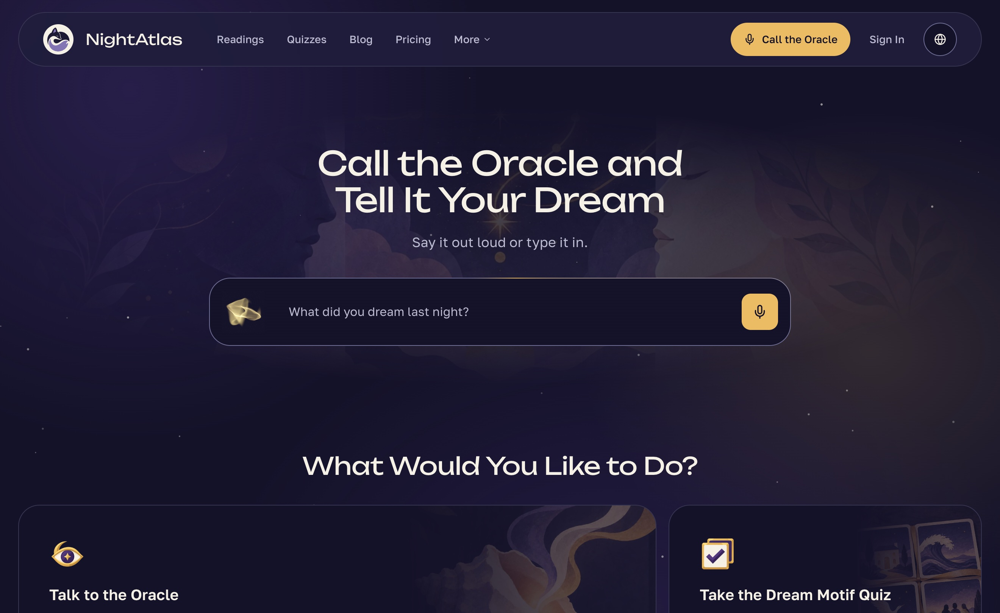

## Hey, I'm Alex

Rust and AI developer with six-plus years of commercial experience, most of it on high-load backends: Kafka pipelines, and a telemetry intake that handled about 200K messages a second. Right now my focus is on AI products.

### Currently building

In my free time I work on two products with my co-founders.

**[LookSee](https://github.com/okoflow/looksee)** is video analytics you host yourself. You connect your cameras, drag a few blocks together in a visual editor, and it starts spotting what you care about and pinging you.

**[Sitefield](https://sitefield.net/)** is a network of web services with AI assistants, built mostly by coding agents. It's live now. The first service is [NightAtlas](https://nightatlas.net/), a dream journal where you write down your dreams and explore their themes with AI.

### Stack

Also Tokio, Axum, gRPC, ClickHouse, RAG and semantic search, plus Claude Code, Codex and MCP.

### Let's talk

I'm open to Rust and AI developer roles.

